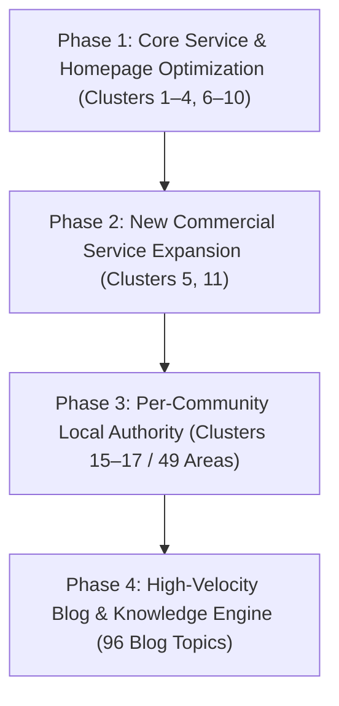

# Dubai Junk Collection — SEO & Content Publishing Roadmap

> **Full Documentation Location:** [`docs/seo/roadmap.md`](file:///d:/Projects/Dubai/rasheed/docs/seo/roadmap.md)  
> **Objective:** Systematically establish topical authority, capture high-intent commercial and informational searches, and funnel organic traffic to WhatsApp/Call conversions across Dubai.  
> **Based on:** 316 Target Keywords & 20 Topic Clusters.

---

## Strategic Phases Overview

---

## Phase 1: Core Commercial & Service Hub Foundation
*Status: Completed & Ongoing Optimization*

* **Homepage (`/`):** Owns head commercial terms (Cluster 1: *junk removal dubai*, *best junk removal dubai*, *junk collection dubai*, *professional junk removal dubai*).
* **Core Service Pages (`/services/*`):**
  1. `/services/household-junk-removal` (Cluster 2)
  2. `/services/furniture-removal` (Cluster 3)
  3. `/services/appliance-removal` (Cluster 4)
  4. `/services/office-junk-removal` (Cluster 6)
  5. `/services/garden-waste-removal` (Cluster 7)
  6. `/services/villa-apartment-cleanouts` (Cluster 8)
  7. `/services/warehouse-commercial-junk-removal` (Cluster 9)
  8. `/services/mattress-bulky-item-removal` (Cluster 10)
* **About Page (`/about`):** Owns trust, licensing, insurance, and credibility signals (Cluster 19).
* **Contact Page (`/contact`):** Owns direct booking, instant quote, and WhatsApp action terms (Cluster 12).

---

## Phase 2: High-Demand Service Page Expansion
*Target: Capturing unserved commercial search demand.*

| Service Page | Primary Target Keywords | Target Audience | Key Differentiator |
| :--- | :--- | :--- | :--- |
| **`/services/e-waste-disposal`** *(Cluster 5)* | `e-waste disposal dubai`, `electronic waste disposal dubai`, `computer disposal dubai`, `laptop disposal dubai`, `e-waste recycling dubai` | Corporate IT managers, tech startups, residential electronics owners | Certified data destruction manifests, zero-landfill recycling partners. |
| **`/services/construction-waste-removal`** *(Cluster 11)* | `construction waste removal dubai`, `renovation waste removal dubai`, `renovation debris disposal dubai`, `building rubble removal dubai`, `skip alternative junk removal dubai` | Interior fitout contractors, villa renovators, property flippers | Same-day bagged rubble haulage without requiring cumbersome public road skip permits. |

---

## Phase 3: Local Community Dominance (49 Geo Pages)
*Status: Live & Indexing (Clusters 15–17)*

* **Priority 1: Waterfront & Luxury Hubs (Cluster 15):** Palm Jumeirah, Dubai Marina, JBR, Downtown Dubai, Business Bay, DIFC, Bluewaters Island, Dubai Creek Harbour, Meydan.
* **Priority 2: Master Villa Enclaves (Cluster 16):** Emirates Hills, Arabian Ranches 1 & 2, Dubai Hills Estate, Al Barari, The Villa, Mudon, Damac Hills 1 & 2, Jumeirah Golf Estates, The Springs, Green Community.
* **Priority 3: High-Density Suburban & Tech Hubs (Cluster 17):** JVC, Al Furjan, Dubai Investment Park, Motor City, Dubai South, Dubai Sports City, Remraam, Silicon Oasis, Nad Al Sheba, Al Quoz, The Greens.

---

## Phase 4: Structured Blog & Topical Authority Engine

The blog opportunities are organized into thematic publishing tracks. Each article targets a primary keyword and multiple secondary keywords from the research, answering specific intent before funneling readers to the relevant service or community page.

---

### Track 1: Pricing, Cost Transparency & Booking Guides (Cluster 12)
*Captures high-intent decision-stage users researching costs.*

| # | Article Title | Primary Target Keyword | Secondary Keywords | Intent | Target Internal Funnel |
| :-: | :--- | :--- | :--- | :---: | :--- |
| **B01** | *Dubai Junk Removal Cost Guide: Realistic Pricing & Truck Load Rates* | `junk removal cost dubai` | `junk removal price dubai`, `junk removal prices dubai`, `how much does junk removal cost in dubai`, `junk removal cost per truck load dubai`, `is junk removal expensive in dubai` | C / Q | `/services`, `/contact` |
| **B02** | *How Much Does Old Furniture & Sofa Removal Cost in Dubai?* | `furniture removal cost dubai` | `furniture disposal dubai` | C | `/services/furniture-removal` |
| **B03** | *Villa Cleanout & Handover Clearance Cost Breakdown in Dubai* | `villa clearance cost dubai` | `villa cleanout dubai`, `end of tenancy clearance dubai` | C | `/services/villa-apartment-cleanouts` |
| **B04** | *How to Book Same-Day Junk Removal via WhatsApp in Dubai* | `whatsapp junk removal dubai` | `book junk removal dubai`, `same day junk pickup booking dubai`, `junk removal quote dubai` | C | `/contact` |

---

### Track 2: Free vs. Paid Removal & Charity Donation (Cluster 13)
*Intercepts competitor "free removal" search volume and converts it through transparency.*

| # | Article Title | Primary Target Keyword | Secondary Keywords | Intent | Target Internal Funnel |
| :-: | :--- | :--- | :--- | :---: | :--- |
| **B05** | *Free vs Paid Junk Removal in Dubai: What Free Services Won't Tell You* | `free vs paid junk removal dubai` | `free junk removal dubai`, `free junk collection dubai`, `is junk removal free in dubai` | I / Q | `/about`, `/services` |
| **B06** | *Where and How to Donate Used Furniture & Household Items in Dubai* | `where to donate furniture in dubai` | `donate old furniture dubai`, `charities that collect furniture dubai`, `where to donate used items dubai`, `furniture donation pickup dubai` | Q / I | `/services/furniture-removal` |
| **B07** | *Free Furniture Removal in Dubai: Which Items Qualify and Which Don't?* | `free furniture removal dubai` | `free furniture pickup dubai` | C / I | `/services/furniture-removal` |

---

### Track 3: Dubai Municipality Rules, Recycling & Sustainability (Cluster 14)
*Builds undeniable E-E-A-T and regulatory authority.*

| # | Article Title | Primary Target Keyword | Secondary Keywords | Intent | Target Internal Funnel |
| :-: | :--- | :--- | :--- | :---: | :--- |
| **B08** | *Dubai Waste Disposal Rules & Fines for Illegal Dumping: The Complete Resident Guide* | `dubai waste disposal rules` | `fines for illegal dumping dubai`, `how to dispose of junk in dubai` | I | `/services` |
| **B09** | *Dubai Municipality Bulky Waste Collection: How It Works & Private Crew Alternatives* | `bulky waste collection dubai municipality` | `dubai municipality junk removal`, `where to throw away furniture in dubai` | I | `/services/mattress-bulky-item-removal` |
| **B10** | *How and Where to Recycle Household Goods in Dubai (Drop-off Centers & Pickups)* | `how to recycle in dubai` | `recycling centres in dubai`, `what can you recycle in dubai`, `landfill vs recycling dubai` | Q / I | `/about`, `/services` |
| **B11** | *Where Does Your Junk Actually Go After Removal in Dubai?* | `where does junk go after removal dubai` | `eco friendly junk disposal dubai` | Q / I | `/about` |

---

### Track 4: Buying Guides, Skip Hire Comparisons & Decision Support (Cluster 18)
*Targets mid-funnel comparison shoppers seeking the best clearance solution.*

| # | Article Title | Primary Target Keyword | Secondary Keywords | Intent | Target Internal Funnel |
| :-: | :--- | :--- | :--- | :---: | :--- |
| **B12** | *Junk Removal vs. Skip Hire in Dubai: Which Is Faster, Cheaper, and Permit-Free?* | `junk removal vs skip hire dubai` | `skip hire dubai alternatives` | I | `/services`, `/services/construction-waste-removal` |
| **B13** | *How to Choose a Junk Removal Company in Dubai: 7 Critical Questions to Ask* | `how to choose a junk removal company dubai` | `what to look for in a junk removal service`, `questions to ask a junk removal company`, `best junk removal companies dubai` | Q / I | `/about`, `/contact` |
| **B14** | *Same-Day vs. Next-Day Junk Removal in Dubai: Managing Urgent Building Handover Timelines* | `same day vs next day junk removal dubai` | `same day junk removal dubai`, `junk removal company reviews dubai` | I / N | `/contact`, `/services` |

---

### Track 5: Moving, Expat Life Events & Situational Decluttering (Clusters 8 & 20)
*Addresses high-stress life transitions and moving events across Dubai.*

| # | Article Title | Primary Target Keyword | Secondary Keywords | Intent | Target Internal Funnel |
| :-: | :--- | :--- | :--- | :---: | :--- |
| **B15** | *The Ultimate Move-Out Checklist for Dubai Tenants: Getting Your Security Deposit Back* | `move out checklist dubai tenants` | `how to get security deposit back dubai`, `moving house junk removal dubai`, `clearing a rental property dubai` | I / Q | `/services/villa-apartment-cleanouts` |
| **B16** | *Leaving Dubai? What to Do with Unwanted Furniture, Electronics & Household Junk* | `what to do with junk when leaving uae` | `expat leaving dubai furniture disposal`, `moving abroad furniture disposal dubai` | Q / I | `/services/furniture-removal`, `/services/villa-apartment-cleanouts` |
| **B17** | *Villa Handover Guide for Dubai Landlords & Tenants: Avoiding Penalty Deductions* | `villa handover guide dubai` | `villa handover clearance dubai` | I | `/services/villa-apartment-cleanouts` |
| **B18** | *Property Clearance for Landlords & Real Estate Agents in Dubai* | `junk removal for landlords dubai` | `junk removal for real estate agents dubai`, `pre-sale property clearance dubai`, `tenant move out junk removal dubai` | L / C | `/services/villa-apartment-cleanouts` |
| **B19** | *Compassionate Deceased Estate & Hoarder Clearance in Dubai* | `hoarder cleanup dubai` | `deceased estate clearance dubai`, `junk removal after death in family dubai` | C / I | `/services/villa-apartment-cleanouts` |
| **B20** | *Seasonal Decluttering in Dubai: Ramadan, New Year & Post-Summer Cleanouts* | `ramadan home clearing dubai` | `new year decluttering dubai`, `end of summer villa clearout dubai` | I | `/services/household-junk-removal` |
| **B21** | *Downsizing Your Home in Dubai: Garage & Storeroom Decluttering Strategies* | `downsizing home dubai tips` | `garage clearance dubai`, `storeroom clearance dubai`, `junk removal after moving dubai` | I / C | `/services/household-junk-removal` |

---

### Track 6: Item-Specific How-To & Disposal Guides (Clusters 2, 3, 4, 5, 6, 7, 10, 11)
*Snippet-optimized guides answering specific "how to dispose of X" queries.*

| # | Article Title | Primary Target Keyword | Secondary Keywords | Intent | Target Internal Funnel |
| :-: | :--- | :--- | :--- | :---: | :--- |
| **B22** | *How to Safely Dispose of Old Furniture & Broken Wardrobes in Dubai* | `how to dispose of old furniture in dubai` | `can you throw away furniture in dubai`, `broken furniture disposal dubai` | Q | `/services/furniture-removal` |
| **B23** | *Where to Dispose of an Old Sofa or Couch in Dubai* | `where to dispose old sofa in dubai` | `what to do with old sofa dubai`, `sofa disposal dubai` | Q | `/services/furniture-removal` |
| **B24** | *How to Dispose of an Old Mattress in Dubai Without Community Fines* | `how to dispose of a mattress in dubai` | `where to throw old mattress dubai`, `mattress disposal dubai` | Q | `/services/mattress-bulky-item-removal` |
| **B25** | *How to Dispose of an Old Fridge in Dubai Safely* | `how to dispose of old fridge in dubai` | `responsible appliance disposal dubai` | Q / I | `/services/appliance-removal` |
| **B26** | *How to Get Rid of an Old AC Unit & Water Heater in Dubai* | `how to get rid of old ac unit dubai` | `air conditioner disposal dubai`, `water heater removal dubai` | Q | `/services/appliance-removal` |
| **B27** | *How to Dispose of Old Laptops & Computers Securely in Dubai* | `how to dispose of old laptop dubai` | `is it illegal to throw electronics in the bin dubai`, `data safe electronics disposal dubai` | Q / I | `/services/e-waste-disposal` |
| **B28** | *How to Safely Clear an Office & Decommission Commercial Furniture in Dubai* | `how to clear an office in dubai` | `cubicle removal dubai`, `office furniture disposal dubai`, `office refit clearance dubai` | Q / I | `/services/office-junk-removal` |
| **B29** | *How to Dispose of Palm Fronds & Green Garden Waste in Dubai Villa Communities* | `how to dispose of garden waste in dubai` | `what to do with palm fronds dubai`, `green waste recycling dubai` | Q / I | `/services/garden-waste-removal` |
| **B30** | *How to Clean Up and Dispose of Construction & Renovation Debris in Dubai* | `how to dispose of construction waste dubai` | `building rubble removal dubai`, `demolition waste removal dubai`, `construction debris removal dubai` | Q / I | `/services/construction-waste-removal` |
| **B31** | *Room-by-Room Decluttering Checklist: Step-by-Step Home Cleanout Guide* | `room by room decluttering checklist` | `how to declutter your home dubai`, `declutter before moving dubai`, `what to do with unwanted household items dubai` | I / Q | `/services/household-junk-removal` |

---

### Track 7: Residential Decluttering, Moving Prep & Household Items (Cluster 2)
*Covers comprehensive residential home decluttering, relocation preparation, and surplus item management.*

| # | Article Title | Primary Target Keyword | Secondary Keywords | Intent | Target Internal Funnel |
| :-: | :--- | :--- | :--- | :---: | :--- |
| **B32** | *How to Declutter Your Home in Dubai: Apartment & Villa Strategies* | `how to declutter your home dubai` | `decluttering high rise apartments dubai`, `villa storeroom clearance dubai`, `residential clutter removal uae` | I | `/services/household-junk-removal` |
| **B33** | *Declutter Before Moving in Dubai: Save Relocation Costs & Moving Day Stress* | `declutter before moving dubai` | `moving house junk removal dubai`, `downsizing moving costs dubai`, `pre move home clearance` | I | `/services/household-junk-removal`, `/services/villa-apartment-cleanouts` |
| **B34** | *What to Do with Unwanted Household Items in Dubai: Donate, Sell, Recycle, or Haul* | `what to do with unwanted household items dubai` | `where to donate used items dubai`, `responsible appliance disposal dubai` | Q | `/services/household-junk-removal`, `/about` |

---

### Track 8: Garage, Storeroom & Post-Move Junk Removal (Cluster 20)
*Covers specialized space clearances including villa garages, apartment utility/maid's rooms, and post-relocation packaging removal.*

| # | Article Title | Primary Target Keyword | Secondary Keywords | Intent | Target Internal Funnel |
| :-: | :--- | :--- | :--- | :---: | :--- |
| **B35** | *Garage Clearance Dubai: Villa Decluttering, Storage Racks & Bulk Junk Removal* | `garage clearance dubai` | `villa garage decluttering`, `dubai residential junk removal`, `bulk waste collection dubai`, `arabian ranches garage cleanout` | C | `/services/household-junk-removal`, `/services` |
| **B36** | *Storeroom Clearance Dubai: How to Declutter Utility & Maid's Rooms* | `storeroom clearance dubai` | `apartment storage room decluttering`, `maids room cleanout dubai`, `utility room junk removal`, `dubai high rise living storage` | C | `/services/household-junk-removal`, `/services` |
| **B37** | *Junk Removal After Moving in Dubai: Fast Disposal for Boxes, Packaging & Leftover Clutter* | `junk removal after moving dubai` | `post move box disposal dubai`, `cardboard recycling dubai moving`, `dubai relocation cleanout`, `packaging waste removal uae` | I | `/services/household-junk-removal`, `/services/villa-apartment-cleanouts` |

---

### Track 9: Office Workflow & Renovation Cleanup (Clusters 6 & 11)
*Separates operational office-move and workplace-reset intent from service-page clearance terms, and separates post-renovation handover workflow from construction-waste disposal rules.*

| # | Article Title | Primary Target Keyword | Secondary Keywords | Intent | Target Internal Funnel |
| :-: | :--- | :--- | :--- | :---: | :--- |
| **B38** | *Office Relocation Junk Removal Dubai: A No-Downtime Clearance Plan* | `office relocation junk removal dubai` | `after hours office clearance dubai`, `office refit clearance dubai`, `office furniture disposal dubai`, `cubicle removal dubai` | I | `/services/office-junk-removal` |
| **B39** | *Decluttering the Workplace for Productivity: A Practical Dubai Office Reset* | `decluttering the workplace productivity` | `office chair disposal dubai`, `office furniture disposal dubai`, `commercial waste disposal dubai`, `business junk removal dubai` | I | `/services/office-junk-removal` |
| **B40** | *Renovation Cleanup Checklist Dubai: From Contractor Exit to Move-In* | `renovation cleanup checklist dubai` | `after renovation cleanup dubai`, `renovation waste removal dubai`, `renovation debris disposal dubai`, `building rubble removal dubai` | I | `/services`, `/contact` |

---

### Track 10: Furniture Decisions, DIY Comparison & Pre-Sale Preparation (Clusters 3, 8 & 18)
*Adds focused decision tools without duplicating the existing donation directory, skip-hire comparison, or tenancy-handover guides.*

| # | Article Title | Primary Target Keyword | Secondary Keywords | Intent | Target Internal Funnel |
| :-: | :--- | :--- | :--- | :---: | :--- |
| **B41** | *Sell vs Donate Old Furniture in Dubai: Which Route Fits Your Timeline?* | `sell vs donate old furniture dubai` | `furniture removal dubai`, `sofa removal dubai`, `wardrobe removal dubai`, `furniture collection dubai` | I | `/services/furniture-removal` |
| **B42** | *DIY Junk Removal vs Hiring a Crew in Dubai: A Practical Cost Test* | `diy junk removal vs hiring dubai` | `skip hire dubai alternatives`, `what to look for in a junk removal service`, `questions to ask a junk removal company` | I | `/services`, `/contact` |
| **B43** | *Decluttering Before Selling Your Home in Dubai: A Two-Pass Plan* | `decluttering before selling your home dubai` | `pre-sale property clearance dubai`, `full house clearance dubai`, `villa handover clearance dubai`, `moving house junk removal dubai` | I | `/services/villa-apartment-cleanouts`, `/contact` |

---

### Track 11: Seasonal Reset, Electronics Recycling & Special Waste (Clusters 2, 5 & 14)
*Adds a finish-line-led seasonal reset, a current device-by-device recycling directory, and a safety-first specialist route for restricted household material.*

| # | Article Title | Primary Target Keyword | Secondary Keywords | Intent | Target Internal Funnel |
| :-: | :--- | :--- | :--- | :---: | :--- |
| **B44** | *Spring Cleaning Junk Removal Dubai: A One-Weekend Reset* | `spring cleaning junk removal dubai` | — | I | `/services/household-junk-removal` |
| **B45** | *Where to Recycle Electronics in Dubai: Devices, Batteries & Drop-Offs* | `where to recycle electronics in dubai` | `e-waste recycling centres dubai` | Q / I | `/services` |
| **B46** | *Hazardous Waste Disposal Dubai: A Safe Household Guide* | `hazardous waste disposal dubai` | — | I | `/services` |

---

### Track 12: Appliance Routes, Bulky Pricing & Low-Waste Clearing (Clusters 4, 10, 12 & 14)
*Separates washing-machine preparation from fridge handling, gives mattresses their own access-led cost guide, and turns sustainability into a practical route hierarchy.*

| # | Article Title | Primary Target Keyword | Secondary Keywords | Intent | Target Internal Funnel |
| :-: | :--- | :--- | :--- | :---: | :--- |
| **B47** | *Where to Dispose of a Washing Machine in Dubai: 4 Safe Routes* | `where to dispose washing machine dubai` | — | Q | `/services/appliance-removal` |
| **B48** | *Mattress Disposal Cost Dubai: What Changes the Quote?* | `mattress disposal cost dubai` | — | C | `/services/mattress-bulky-item-removal` |
| **B49** | *Sustainable Decluttering Tips Dubai: A Low-Waste Plan* | `sustainable decluttering tips dubai` | — | I | `/services/household-junk-removal` |

---

### Track 13: Tenancy Handover, Rental Clearance & Move-Out Logistics (Clusters 8 & 20)
*Covers practical tenant security deposit recovery, complete end-of-tenancy rental clearances, and separating movers from bulk junk haulers.*

| # | Article Title | Primary Target Keyword | Secondary Keywords | Intent | Target Internal Funnel |
| :-: | :--- | :--- | :--- | :---: | :--- |
| **B50** | *How to Get Your Security Deposit Back in Dubai: Move-Out Clearance & Snagging Guide* | `how to get security deposit back dubai` | `move out clearance dubai`, `dubai tenancy handover inspection`, `rera deposit dispute dubai`, `ejari move out cleanout` | Q | `/services/villa-apartment-cleanouts`, `/services/household-junk-removal` |
| **B51** | *Clearing a Rental Property in Dubai: Complete End-of-Tenancy Cleanout Guide* | `clearing a rental property dubai` | `end of tenancy cleanout dubai`, `landlord property clearance`, `abandoned furniture removal dubai`, `apartment handover junk removal` | I | `/services/villa-apartment-cleanouts`, `/services` |
| **B52** | *Moving House Junk Removal in Dubai: What Movers Won't Take & How to Clear It* | `moving house junk removal dubai` | `relocation clutter clearance`, `pre move furniture purge`, `dubai moving day checklist`, `movers and junk removal uae` | I | `/services/household-junk-removal`, `/services/villa-apartment-cleanouts` |

---

### Track 14: Oversized & Awkward Single-Item Disposal (Clusters 5 & 10)
*Closes the remaining gaps in the item-specific disposal series. Each article owns a Q-intent item query whose commercial counterpart already sits on `/services/mattress-bulky-item-removal`, and each is built around a physical constraint (shape, mass, fragility) rather than a repeat of the general disposal-route guides.*

| # | Article Title | Primary Target Keyword | Secondary Keywords | Intent | Target Internal Funnel |
| :-: | :--- | :--- | :--- | :---: | :--- |
| **B53** | *How to Dispose of Old Carpets & Rugs in Dubai Without Blocking a Service Lift* | `how to dispose of old carpet in dubai` | `carpet removal dubai`, `bulky item removal dubai`, `single item junk removal dubai`, `heavy item removal dubai` | Q | `/services/mattress-bulky-item-removal` |
| **B54** | *How to Get Rid of Home Gym Equipment in Dubai: Treadmills, Weights & Multi-Gyms* | `how to dispose of gym equipment in dubai` | `gym equipment removal dubai`, `treadmill disposal dubai`, `heavy item removal dubai`, `bulky item removal dubai` | Q | `/services/mattress-bulky-item-removal` |
| **B55** | *How to Dispose of an Old TV in Dubai: Screens, Wall Brackets & Safe Handling* | `how to dispose of old tv in dubai` | `bulky item removal dubai`, `single item junk removal dubai`, `e-waste recycling centres dubai` | Q | `/services/appliance-removal` |

**Overlap check (content-rules §16):** B53 is distinguished from B22/B23 (indoor furniture) and B09 (municipality bulky pickup) by rolled-length vs lift-diagonal access and the underlay/gripper-rod handover problem. B54 is distinguished from B35 (garage clearance as a space) by treating mass and trolley/lift load limits as the subject. B55 is distinguished from B45 (electronics recycling directory) and B27 (laptop data security) by panel fragility, unmounting, and wall reinstatement.

### Track 15: Industrial Unit Handover, Textile Routes & Outdoor Furniture (Clusters 3, 9 & 13)
*Closes the three remaining structural gaps in the plan: Cluster 9 had no informational article at all, Cluster 13 had no route for textiles as opposed to furniture, and outdoor furniture had never been separated from indoor furniture disposal despite behaving completely differently in this climate.*

| # | Article Title | Primary Target Keyword | Secondary Keywords | Intent | Target Internal Funnel |
| :-: | :--- | :--- | :--- | :---: | :--- |
| **B56** | *How to Clear a Warehouse in Dubai: Racking, Stock and Unit Handover* | `how to clear a warehouse in dubai` | `racking removal dubai`, `pallet disposal dubai`, `stock clearance disposal dubai`, `scrap removal dubai`, `industrial junk removal dubai`, `al quoz junk removal` | Q / I | `/services/warehouse-commercial-junk-removal` |
| **B57** | *Where to Donate or Recycle Old Clothes in Dubai: Bins, Bags and What Gets Refused* | `where to donate clothes in dubai` | `clothes donation bins dubai`, `textile recycling dubai`, `where to donate used items dubai` | Q | `/services/household-junk-removal` |
| **B58** | *How to Dispose of Sun-Damaged Outdoor and Balcony Furniture in Dubai* | `how to dispose of garden furniture in dubai` | `outdoor furniture disposal dubai`, `broken furniture disposal dubai` | Q | `/services/furniture-removal` |

**Overlap check (content-rules §16):** B56 is distinguished from B28 (office clearance in a tower) and B40 (post-renovation cleanup) by loading-bay throughput, racking dismantling sequence and industrial reinstatement clauses. B57 is distinguished from B06 (furniture donation directory) and B34 (the four-pathway decision for household goods) by textile-specific condition thresholds, collection-box capacity and fibre recovery. B58 is distinguished from B22 (indoor furniture) and B29 (organic green waste) by UV and salt degradation, material separation for scrap, and the balcony route-down constraint.

### Track 16: Expat Relocation Liquidation, Bulky Dumping Legality & E-Waste Bans (Clusters 3, 5 & 20)
*Addresses high-stakes departure logistics, the universal question of chute/dumpster legality in Dubai towers, and the legal ban and battery hazards of throwing electronics in general bins.*

| # | Article Title | Primary Target Keyword | Secondary Keywords | Intent | Target Internal Funnel |
| :-: | :--- | :--- | :--- | :---: | :--- |
| **B59** | *Moving Abroad from Dubai: Furniture Disposal, Shipping Math & Handover Deadlines* | `moving abroad furniture disposal dubai` | `expat leaving dubai furniture disposal`, `leaving uae furniture clearout`, `relocation furniture purge`, `tenancy security deposit` | I | `/services/villa-apartment-cleanouts`, `/services/furniture-removal` |
| **B60** | *Can You Throw Away Furniture in Dubai? Chute Rooms, Fines & Legal Bulky Routes* | `can you throw away furniture in dubai` | `where to throw away furniture in dubai`, `fines for illegal dumping dubai`, `dubai waste disposal rules`, `bulky waste collection` | Q | `/services/furniture-removal`, `/services/household-junk-removal` |
| **B61** | *Is It Illegal to Throw Electronics in the Bin in Dubai? Laws, Risks & Safe Drop-Offs* | `is it illegal to throw electronics in the bin dubai` | `data safe electronics disposal dubai`, `e-waste recycling centres dubai`, `electronic waste disposal dubai`, `hazardous waste dubai` | Q | `/services/household-junk-removal`, `/services` |

**Overlap check (content-rules §16):** B59 is distinguished from B16 (general departure framework) and B52 (domestic move junk) by focusing specifically on international container volume arithmetic vs local replacement costs and the critical 72-hour handover window. B60 is distinguished from B08 (general waste rules) and B22 (furniture dismantling) by directly resolving the high-volume binary query about chute rooms, dumpster abandonment, CCTV security enforcement, and municipal fines. B61 is distinguished from B45 (drop-off directory) and B27 (laptop security) by detailing UAE Federal Law No. 12 of 2018, municipal compactor fire hazards from lithium batteries, and electronic scrap segregation.

### Track 17: Fragile & Specialist Bulky Items (Cluster 10)
*Extends the item-specific series into objects whose material, balance or construction makes ordinary furniture handling unsafe.*

| # | Article Title | Primary Target Keyword | Secondary Keywords | Intent | Target Internal Funnel |
| :-: | :--- | :--- | :--- | :---: | :--- |
| **B62** | *How to Dispose of a Large Mirror or Glass Tabletop in Dubai* | `how to dispose of a large mirror in dubai` | `glass tabletop removal dubai`, `fragile bulky item removal`, `large mirror disposal dubai` | Q | `/services/mattress-bulky-item-removal` |
| **B63** | *How to Dispose of a Pool Table in Dubai Without Damaging Slate or Floors* | `how to dispose of a pool table in dubai` | `pool table removal dubai`, `slate pool table disposal`, `heavy item removal dubai` | Q | `/services/mattress-bulky-item-removal` |
| **B64** | *How to Dispose of an Old Piano in Dubai: Donation, Access and Safe Removal* | `how to dispose of old piano in dubai` | `piano removal dubai`, `piano donation dubai`, `heavy item removal dubai` | Q | `/services/mattress-bulky-item-removal` |

**Overlap check (content-rules §16):** B62 is distinguished from B22/B23 by glass identification, face-and-edge protection and an upright A-frame route. B63 is distinguished from B54 by slate-bed identification, ordered table dismantling and levelling-component control. B64 is distinguished from general furniture donation and moving guides by musical-condition triage, piano-dolly handling and upright-versus-grand access planning.

### Track 18: Bedroom, Kitchen & Bookshelf Clear-Outs (Clusters 2, 3 & 4)
*Covers three everyday items whose disposal depends on a preparation step first: dismantling a bed frame, isolating an oven's gas or power supply, and sorting a book collection by condition.*

| # | Article Title | Primary Target Keyword | Secondary Keywords | Intent | Target Internal Funnel |
| :-: | :--- | :--- | :--- | :---: | :--- |
| **B65** | *How to Dispose of a Bed Frame in Dubai: Divans, Ottoman Lifts and Bunk Beds* | `how to dispose of a bed frame in dubai` | `bed frame disposal dubai`, `bed removal dubai`, `broken furniture disposal dubai` | Q | `/services/furniture-removal` |
| **B66** | *How to Dispose of an Old Oven or Cooker in Dubai: Gas, Wiring and Ownership Checks* | `how to dispose of an old oven in dubai` | `oven removal dubai`, `responsible appliance disposal dubai`, `old appliance removal dubai` | Q | `/services/appliance-removal` |
| **B67** | *How to Dispose of Old Books in Dubai: Resale, Donation and Paper Recycling* | `how to dispose of old books in dubai` | `how to declutter your home dubai`, `clear out old stuff dubai` | Q | `/services/household-junk-removal` |

**Overlap check (content-rules §16):** B65 is distinguished from B22 (general furniture and wardrobes) and B24 (mattresses) by frame-type identification, gas-lift ottoman struts, bunk-bed sequencing and hardware retention for reuse. B66 is distinguished from B25 (fridge refrigerant) and B47 (washing machine draining) by landlord fitting ownership, gas isolation by the provider, and hard-wired cooker-switch disconnection. B67 is distinguished from B57 (textiles) and B32/B34 (general decluttering routes) by book condition triage, humidity and mould checks, paper-recycling preparation and box-weight handling.

### Track 19: Family Gear, Bicycles & Bathroom Refits (Clusters 10, 11 & 13)
*Covers three items people keep far longer than they use: outgrown baby gear with safety limits on reuse, bicycles and e-bikes with batteries to separate, and bathtubs that are fixed into the building.*

| # | Article Title | Primary Target Keyword | Secondary Keywords | Intent | Target Internal Funnel |
| :-: | :--- | :--- | :--- | :---: | :--- |
| **B68** | *How to Dispose of Baby Items in Dubai: Cots, Strollers, Car Seats and Outgrown Gear* | `how to dispose of baby items in dubai` | `where to donate used items dubai`, `where to donate clothes in dubai` | Q | `/services/household-junk-removal` |
| **B69** | *How to Dispose of an Old Bicycle in Dubai: Bikes, E-Bikes and Batteries* | `how to dispose of an old bicycle in dubai` | `bulky item removal dubai`, `single item junk removal dubai` | Q | `/services/mattress-bulky-item-removal` |
| **B70** | *How to Dispose of an Old Bathtub in Dubai: Acrylic, Steel and Cast-Iron Tubs* | `how to dispose of an old bathtub in dubai` | `renovation debris disposal dubai`, `how to dispose of construction waste dubai` | Q | `/services/villa-apartment-cleanouts` |

**Overlap check (content-rules §16):** B68 is distinguished from B34 (general unwanted household items) and B57 (textiles) by car-seat expiry and collision history, cot and stroller safety triage, and hygiene limits on cot mattresses. B69 is distinguished from B54 (gym equipment) and B35 (garage clearance) by ride-or-scrap frame assessment, lithium e-bike and e-scooter battery separation, and bike-room ownership checks. B70 is distinguished from B30 (general construction debris) and B40 (renovation cleanup) by tub-material identification, plumbing and whirlpool isolation, and cast-iron break-up versus whole removal.

---

## Publishing Cadence & Execution Plan

1. **Batch 1 (Articles B01–B07):** Cost, Pricing Transparency & "Free" Intercepts (captures immediate commercial conversion queries) — **100% Completed (7/7 Live)**.
2. **Batch 2 (Articles B08–B14):** Municipality Rules, Skip Comparisons & Sustainability (establishes trust & snippet dominance) — **100% Completed (7/7 Live)**.
3. **Batch 3 (Articles B15–B21):** Expat Move-Outs, Handover Checklists & Situational Guides (high seasonal demand) — **100% Completed (7/7 Live)**.
4. **Batch 4 (Articles B22–B31):** Item-Specific "How-To Dispose" Snippet Series (captures long-tail question traffic) — **100% Completed (10/10 Live)**.
5. **Batch 5 (Articles B32–B37):** Residential Decluttering, Storage & Post-Move Clearance — **6/10 Completed (60%)**.
6. **Batch 6 (Articles B38–B40):** Office Workflow & Renovation Cleanup — **100% Completed (3/3 Live)**.
7. **Batch 7 (Articles B41–B43):** Decision Support & Pre-Sale Preparation — **100% Completed (3/3 Live)**.
8. **Batch 8 (Articles B44–B46):** Seasonal Reset, Electronics Recycling & Special Waste — **100% Completed (3/3 Live)**.
9. **Batch 9 (Articles B47–B49):** Appliance Routes, Bulky Pricing & Low-Waste Clearing — **100% Completed (3/3 Live)**.
10. **Batch 10 (Articles B50–B52):** Tenancy Handover, Rental Clearance & Move-Out Logistics — **100% Completed (3/3 Live)**.
11. **Batch 11 (Articles B53–B55):** Oversized & Awkward Single-Item Disposal — **100% Completed (3/3 Live)**.
12. **Batch 12 (Articles B56–B58):** Industrial Unit Handover, Textile Routes & Outdoor Furniture — **100% Completed (3/3 Live)**.
13. **Batch 13 (Articles B59–B61):** Expat Relocation Liquidation, Bulky Dumping Legality & E-Waste Bans — **100% Completed (3/3 Live)**.
14. **Batch 14 (Articles B62–B64):** Fragile & Specialist Bulky Items — **100% Completed (3/3 Live)**.
15. **Batch 15 (Articles B65–B67):** Bedroom, Kitchen & Bookshelf Clear-Outs — **100% Completed (3/3 Live)**.
16. **Batch 16 (Articles B68–B70):** Family Gear, Bicycles & Bathroom Refits — **100% Completed (3/3 Live)**.

